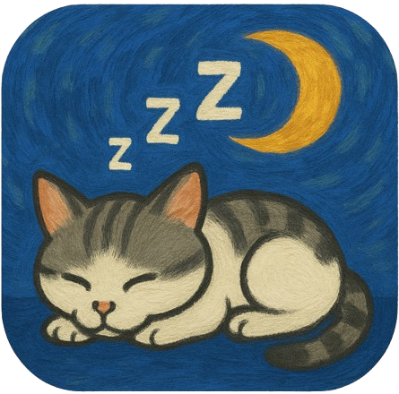

# 🐱 Sleeping Cat for Windows

A peaceful desktop companion that sleeps on your screen. Watch as the cat's tail gently sways while it dreams.

🍎 **Looking for macOS version?** → [SleepingCat for macOS](https://github.com/daiokawa/SleepingCat)

https://github.com/user-attachments/assets/c2ed51d1-18f2-42eb-8258-3207bf892022

You can place your cat anywhere on your screen like this.



## ✨ Features

- 🌙 Adorable sleeping cat animation
- 🪶 Transparent window that floats on your desktop
- 🎯 Stays on top of other windows
- 🎨 Hand-drawn artwork
- 💤 Realistic tail movement (hybrid static/animated approach)

## 📦 Installation

### Easy Install
1. Download the latest installer from [Releases](https://github.com/daiokawa/SleepingCat-Windows/releases)
2. Run "Sleeping Cat Setup X.X.X.exe"
3. Follow the installation wizard
4. Launch from Start Menu or Desktop shortcut

### Manual Build
```bash
git clone https://github.com/daiokawa/SleepingCat-Windows.git
cd SleepingCat-Windows
npm install
npm run build-win
```

## 🎮 Usage

- **Launch**: Start Menu → Sleeping Cat (or Desktop shortcut)
- **Move**: Click and drag the cat to reposition
- **Quit**: Right-click on the cat and select "Quit"

## 🖥 System Requirements

- Windows 10/11 (64-bit)
- 100MB of free space

## 🛠 Technical Details

- Built with Electron
- WebM video format with VP9 codec for transparency
- Transparent frameless window
- Always-on-top behavior
- Hybrid static/animated video approach for optimal performance

## 📝 License

MIT License - See [LICENSE](LICENSE) file for details

## 🙏 Acknowledgments

- Original cat video and artwork created with love
- macOS version: [SleepingCat](https://github.com/daiokawa/SleepingCat)
- Built with [Electron](https://www.electronjs.org/)

## 🐛 Troubleshooting

**Cat not appearing?**
- Check your system tray - the app might be minimized
- Make sure no other windows are in full-screen mode
- Try relaunching the app

**Performance issues?**
- Close other transparent window applications
- Update your graphics drivers
- Try restarting Windows Explorer

**Can't move the cat?**
- Make sure you're clicking directly on the cat
- The window might be behind other always-on-top windows

---

Made with ❤️ for cat lovers on Windows